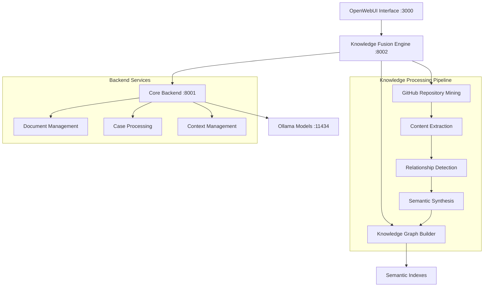

# Topology Knowledge Platform
*Next-Generation Knowledge Synthesis Beyond Traditional RAG*

## � Complete Documentation

### 🎯 **NEW: [Complete User Guide](docs/COMPLETE_USER_GUIDE.md)**
**Everything you need to know in one place:**
- **Quick Start**: Get running in minutes
- **Theory of Design**: Understanding the innovative architecture
- **Usage Guide**: Practical examples and patterns
- **Data Population**: How the system learns and evolves
- **Future Extensions**: Roadmap and possibilities

## �🚀 Quick Setup

### Repository Cloning

#### For Most Users (Auto-detection)
```bash
git clone https://github.com/jidemobell/knowledgebase.git
cd knowledgebase
./setup.sh
```

#### For Enterprise/IBM Environments (HTTPS only)
```bash
git clone https://github.com/jidemobell/knowledgebase.git
cd knowledgebase
./setup.sh --https
```

#### For Development Environments (SSH preferred)
```bash
git clone git@github.com:jidemobell/knowledgebase.git
cd knowledgebase
./setup.sh --ssh
```

#### Manual Submodule Setup
```bash
# If openwebuibase folder is empty after cloning:
git submodule update --init --recursive
```

> **🏢 Enterprise Note**: The setup script automatically detects your environment and uses the appropriate connection method (HTTPS for enterprise, SSH for development).

### One-Command Launch
```bash
./start.sh
# Select option 1: 🖥️ SERVER MODE
# Access at http://localhost:3000
```

---

## 🧠 Beyond RAG: Intelligent Knowledge Topology

Unlike traditional RAG systems that simply retrieve and inject documents, the Topology Knowledge Platform represents a fundamental paradigm shift. We've architected an **intelligent knowledge synthesis engine** that understands the topology of information—the complex relationships, dependencies, and contextual connections that exist within and across knowledge domains.

### Traditional RAG Limitations
- Static document retrieval with limited context
- No relationship mapping between concepts
- Isolated information silos
- Surface-level semantic matching

### Our Topology Approach
- **🗺️ Semantic Knowledge Mapping**: Understanding how concepts relate across domains
- **🔄 Dynamic Context Synthesis**: Building coherent narratives from fragmented sources  
- **📈 Adaptive Learning Networks**: Knowledge graphs that evolve with usage patterns
- **🔍 Multi-Dimensional Analysis**: Code, documentation, issues, and discussions as interconnected layers

---

## 🚀 Quick Start

### One-Command Launch
```bash
./start.sh
```

Choose your deployment strategy:

#### 🖥️ **Server Mode** (Development & Maximum Control)
```bash
./start_server_mode.sh
```
- Direct service access and debugging
- Real-time log monitoring  
- Easy configuration adjustments
- Optimal for development and customization

#### 🐳 **Containerized Mode** (Production & Consistency)
```bash
./start_docker_mode.sh
```
- Containerized deployment with isolated environments
- **Docker & Podman Support** - Automatically detects your container runtime
- Automatic service orchestration
- Production-ready configuration
- Consistent deployment across systems (perfect for IBM/enterprise environments)

---

## 🏗️ System Architecture



### Core Components

#### 🎯 **OpenWebUI Frontend** (Port 3000)
Modern conversational interface providing:
- Real-time visualization of knowledge connections
- Multi-modal interaction supporting text, code, and visual elements
- Context-aware suggestion engine
- Interactive knowledge exploration

#### 🔮 **IBM Knowledge Fusion Engine** (Port 8002)
Revolutionary knowledge synthesis layer that:
- **Mines GitHub repositories** for code patterns, documentation, and project relationships
- **Builds semantic knowledge graphs** connecting concepts across repositories
- **Identifies knowledge gaps** and suggests missing connections
- **Creates dynamic context windows** that expand based on conversation depth

#### ⚡ **QwenRoute Core Backend** (Port 8001)
High-performance FastAPI service providing:
- Advanced document processing with semantic chunking
- Case management for complex knowledge domains
- Session context preservation across interactions
- Real-time knowledge graph updates

#### 🤖 **Ollama Model Infrastructure** (Port 11434)
- Local LLM hosting optimized for knowledge synthesis
- Multi-model ensemble for specialized reasoning
- Context-aware model selection based on query complexity

---

## 📊 Knowledge Integration Pipeline

### 1. Repository Mining & Content Extraction
The Knowledge Fusion engine automatically:
- **Clones and analyzes** GitHub repositories from `github_sources.yml`
- **Extracts semantic content** from code, documentation, issues, and wikis
- **Identifies project relationships** and cross-references
- **Maps contributor expertise** and knowledge ownership

### 2. Semantic Processing & Relationship Mapping
- **Content vectorization** using state-of-the-art embeddings
- **Relationship extraction** between code concepts and documentation
- **Dependency mapping** across repositories and technologies
- **Knowledge graph construction** with weighted connections

### 3. Dynamic Synthesis & Context Generation
- **Context-aware retrieval** based on conversation history
- **Multi-source synthesis** combining code, docs, and community knowledge
- **Gap identification** highlighting missing information or connections
- **Adaptive learning** improving responses based on user interactions

---

## 🎯 Beyond Traditional RAG: Novel Approaches

### Temporal Knowledge Synthesis
Our system doesn't just retrieve current information—it understands:
- **Historical patterns** in code evolution and documentation changes
- **Current state analysis** across multiple repositories and sources
- **Predictive insights** about potential issues and optimization opportunities

### Multi-Agent Knowledge Orchestration
Unlike single-model approaches, we employ:
- **Specialized agents** for different knowledge domains (code, docs, issues)
- **Collaborative synthesis** where agents build upon each other's findings
- **Dynamic routing** to the most appropriate model based on query complexity

### Adaptive Knowledge Graphs
Our knowledge representation:
- **Evolves dynamically** based on user interactions and new content
- **Maintains confidence weights** for different information sources
- **Identifies knowledge boundaries** and areas requiring human expertise

---

## 🔧 Configuration & Customization

### GitHub Knowledge Sources
Configure repositories in `github_sources.yml`:
```yaml
repositories:
  - name: "core-platform"
    url: "https://github.com/your-org/platform"
    branch: "main" 
    focus_areas: ["architecture", "api-docs", "examples"]
    
  - name: "ml-toolkit"
    url: "https://github.com/your-org/ml-tools" 
    branch: "develop"
    focus_areas: ["algorithms", "datasets", "benchmarks"]
```

### Backend Configuration
Core services utilize `.env` settings:
```bash
# Knowledge Fusion Settings
KNOWLEDGE_FUSION_DEPTH=3           # Relationship traversal depth
KNOWLEDGE_FUSION_SIMILARITY=0.8    # Semantic similarity threshold

# Core Backend Settings
CORE_BACKEND_CACHE_SIZE=1000       # Document cache size
CORE_BACKEND_CONTEXT_WINDOW=4096   # Context preservation limit

# Model Settings
OLLAMA_MODELS=mistral,codellama     # Available models
OLLAMA_TIMEOUT=30                   # Response timeout
```

---

## 🛠️ Backend Service Integration

### How the Backends Work Together

#### Knowledge Fusion Engine (Port 8002)
**Primary Role**: Intelligent knowledge synthesis and GitHub integration
- **Repository Analysis**: Deep mining of code structure, documentation, and metadata
- **Semantic Indexing**: Building searchable knowledge representations  
- **Relationship Mapping**: Connecting concepts across repositories and domains
- **Context Generation**: Creating rich context for LLM interactions

**Data Sources**:
- GitHub repositories (code, docs, issues, wikis)
- Local document uploads
- Conversation history and user preferences
- External APIs and knowledge bases

#### Core Backend (Port 8001) 
**Primary Role**: Document processing and case management
- **Document Processing**: Advanced parsing with semantic chunking strategies
- **Case Management**: Structured handling of complex knowledge domains
- **Session Context**: Preserving conversation state and learned preferences
- **Real-time Updates**: Dynamic knowledge graph maintenance

**Use Cases**:
- Processing uploaded documents and files
- Managing structured knowledge cases
- Maintaining conversation context across sessions
- Providing fast document retrieval and search

### Data Flow Architecture
```
GitHub Repos → Content Extraction → Semantic Analysis → Knowledge Graph
     ↓              ↓                    ↓                ↓
User Query → Context Building → Multi-Source Synthesis → Response Generation
     ↓              ↓                    ↓                ↓
Knowledge Fusion (8002) → Core Backend (8001) → Ollama (11434) → OpenWebUI (3000)
```

### Installation & Data Management

The unified startup system automatically:

1. **Sets up Python 3.11 environment** optimized for OpenWebUI compatibility
2. **Installs all dependencies** including Knowledge Fusion and Core Backend services
3. **Configures GitHub integration** based on `github_sources.yml`
4. **Initializes knowledge bases** from configured repositories
5. **Starts all services** with proper health checks and monitoring

**Where Knowledge Data Lives**:
- **Repository clones**: `openwebuibase/knowledge-fusion/repositories/`
- **Processed indexes**: `openwebuibase/knowledge-fusion/indexes/`
- **Knowledge graphs**: `corebackend/implementation/knowledge_graphs/`
- **Document cache**: `corebackend/implementation/cache/`
- **Session data**: `openwebuibase/backend/data/`

**GitHub Repository Incorporation**:
The system continuously:
- **Monitors configured repositories** for changes
- **Extracts knowledge patterns** from code and documentation
- **Updates semantic indexes** with new content
- **Maintains relationship mappings** between concepts
- **Preserves historical context** for temporal analysis

---

## 🎯 Advanced Usage Patterns

### Knowledge Exploration
Instead of simple Q&A, engage in **knowledge discovery**:
- *"Show me the architectural patterns used across our microservices"*
- *"How do the authentication systems in these three repos connect?"*
- *"What are the common performance bottlenecks mentioned in issues?"*

### Code Understanding  
Go beyond basic code search:
- *"Explain the data flow from user input to database in this system"*
- *"What design patterns are consistently used across these repositories?"*
- *"How would implementing feature X affect the existing architecture?"*

### Documentation Synthesis
Create comprehensive overviews:
- *"Generate an onboarding guide combining all our repository READMEs"*
- *"What are the best practices mentioned across our codebases?"*
- *"Create a troubleshooting guide from our collective issue discussions"*

---

## 📚 Documentation Library

### 🚀 Essential Guides
- **[Unified Startup Guide](docs/UNIFIED_STARTUP_GUIDE.md)** - Complete deployment instructions
- **[Complete Setup Guide](docs/COMPLETE_SETUP_GUIDE.md)** - Detailed installation and configuration
- **[API Documentation](docs/QWENROUTE_API_DOCUMENTATION.md)** - Complete backend API reference
- **[IBM Deployment Guide](docs/IBM_DEPLOYMENT_GUIDE.md)** - Enterprise deployment strategies

### 🏗️ Architecture & Design
- **[Knowledge Fusion Architecture](docs/KNOWLEDGE_FUSION_ARCHITECTURE.md)** - Deep dive into synthesis engine
- **[Project Vision](docs/PROJECT_VISION.md)** - Long-term roadmap and innovation goals
- **[Integration Plan](docs/INTEGRATION_PLAN.md)** - Component integration strategy

### 🔧 Technical References
- **[Model Integration](docs/MODEL_INTEGRATION.md)** - LLM configuration and optimization
- **[Docker Deployment](docs/DOCKER_DEPLOYMENT.md)** - Container orchestration details
- **[Podman Support](docs/PODMAN_SUPPORT.md)** - Enterprise container runtime compatibility
- **[OpenWebUI Setup](docs/OPENWEBUI_SETUP.md)** - Frontend configuration

> **🏢 Enterprise Note**: Our containerized mode automatically detects and supports both **Docker** and **Podman**. Perfect for IBM and other enterprise environments where Podman is preferred. The system seamlessly adapts to your container runtime without any configuration changes.

### 📋 Operations
- **[Migration Guide](docs/MIGRATION_GUIDE.md)** - Environment transfer procedures
- **[Git Submodule Guide](docs/GIT_SUBMODULE_GUIDE.md)** - Managing the OpenWebUI submodule
- **[SSO Integration](docs/SSO_INTEGRATION_GUIDE.md)** - Enterprise authentication setup
- **[Startup Guide](docs/STARTUP_GUIDE.md)** - Quick testing and demo procedures

> **🔧 Repository Setup**: This project uses git submodules for OpenWebUI integration. When cloning, use `git clone --recursive` or run `git submodule update --init --recursive` after cloning.

---

## 🚨 Troubleshooting

### Service Health Check
```bash
./start.sh
# Select: "3) Check Service Status"
```

### Common Resolutions
- **Port Conflicts**: Verify ports 3000, 8001, 8002, 11434 are available
- **Ollama Issues**: Ensure models are pulled with `ollama list`
- **Memory Constraints**: Monitor RAM usage during large repository processing
- **GitHub Rate Limits**: Configure authentication tokens for private repos

### Debug Mode
Enable detailed logging:
```bash
export DEBUG_MODE=true
./start_server_mode.sh
```

---

## 🌟 What Makes This Revolutionary

Unlike traditional RAG systems that simply retrieve and inject documents, our Topology Knowledge Platform:

### 1. **Understands Relationships**
Maps how concepts connect across different repositories, documentation, and conversation contexts—not just keyword matching but true semantic understanding.

### 2. **Learns Contextually**  
Builds understanding of your specific knowledge domain and usage patterns, adapting responses based on your project's unique characteristics.

### 3. **Synthesizes Intelligently**
Creates novel insights by combining information from multiple sources, identifying patterns and connections that weren't explicitly documented.

### 4. **Evolves Dynamically**
Continuously improves knowledge graphs based on new content, user interactions, and emerging patterns in your repositories.

### 5. **Preserves Context**
Maintains conversation threads that build upon previous knowledge discoveries, creating a persistent understanding that grows over time.

### 6. **Anticipates Needs**
Uses temporal analysis to predict potential issues, suggest optimizations, and highlight knowledge gaps before they become problems.

---

## 🎯 Innovation Highlights

### Temporal Knowledge Synthesis
- **Historical Analysis**: Understanding how your codebase and documentation have evolved
- **Current State Mapping**: Real-time analysis of your complete knowledge landscape
- **Future Predictions**: Identifying potential issues and optimization opportunities

### Multi-Agent Orchestration
- **Specialized Agents**: Different models optimized for code, documentation, and conversation
- **Collaborative Intelligence**: Agents that build upon each other's findings
- **Dynamic Routing**: Intelligent selection of the best model for each query type

### Novel Architecture Patterns
- **Knowledge Graph Evolution**: Graphs that learn and adapt based on usage
- **Confidence Weighting**: Understanding reliability and trustworthiness of different sources
- **Semantic Bridging**: Connecting concepts across traditionally isolated domains

---

This isn't just better search—it's **intelligent knowledge partnership** that grows with your understanding and helps you discover connections you never knew existed.

**Transform your repositories into intelligent knowledge ecosystems. Start exploring the topology of your information landscape today.**
