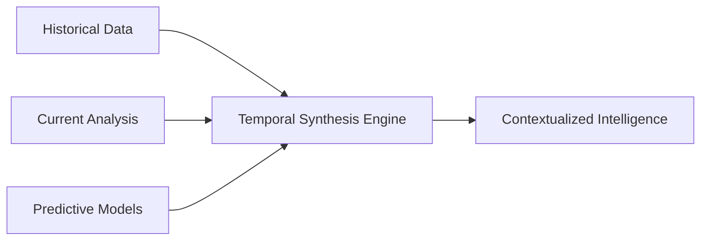

# 🚀 Knowledge Fusion Platform - Complete User Guide

## Table of Contents
- [Quick Start](#quick-start)
- [Platform Overview](#platform-overview)
- [Theory of Design](#theory-of-design)
- [Usage Guide](#usage-guide)
- [Data Population](#data-population)
- [Advanced Features](#advanced-features)
- [Future Extensions](#future-extensions)
- [Troubleshooting](#troubleshooting)

---

## Quick Start

### Prerequisites
- **macOS/Linux**: Tested on macOS, Linux compatible
- **Python 3.11+**: Required for all components
- **Node.js 18-22**: Required for OpenWebUI frontend (if building from source)
- **Ollama**: Local LLM runtime
- **8GB RAM minimum**: 16GB+ recommended for optimal performance

### Installation & Startup

1. **Clone and Setup**
   ```bash
   git clone <repository-url>
   cd TOPOLOGYKNOWLEDGE
   ```

2. **Start the Platform**
   ```bash
   ./start.sh
   # Select option 1: 🖥️ SERVER MODE
   ```

3. **Access Points**
   - **OpenWebUI Interface**: http://localhost:3000
   - **Core Backend API**: http://localhost:8001
   - **Knowledge Fusion API**: http://localhost:8002
   - **Ollama API**: http://localhost:11434

4. **First-Time Setup**
   - Open http://localhost:3000
   - Create your admin account
   - Go to Settings → Functions → Enable 'IBM Knowledge Fusion'
   - Start exploring!

---

## Platform Overview

### 🧠 What is Knowledge Fusion?

Knowledge Fusion is a next-generation AI platform that **goes beyond traditional RAG and multi-agent systems** by implementing:

- **Temporal Knowledge Synthesis**: Understands how knowledge evolves over time
- **Multi-Source Intelligence**: Fuses insights from code, documents, conversations, and real-time data
- **Predictive Reasoning**: Anticipates future trends and provides proactive insights
- **Dynamic Learning**: Continuously adapts and improves from interactions

### 🎯 Key Differentiators

| Traditional Systems | Knowledge Fusion Platform |
|---------------------|---------------------------|
| Static retrieval (RAG) | Dynamic temporal synthesis |
| Single-turn responses | Continuous knowledge evolution |
| Document-based only | Multi-modal source fusion |
| Reactive assistance | Predictive intelligence |
| Fixed knowledge base | Self-improving knowledge graph |

---

## Theory of Design

### 🔬 Core Architectural Principles

#### 1. **Temporal Knowledge Intelligence**
Traditional systems treat knowledge as static snapshots. Our platform recognizes that knowledge has **temporal dimensions**:

- **Historical Context**: Understanding how concepts evolved
- **Current State**: Real-time knowledge synthesis
- **Future Projection**: Predictive insights and trend analysis



#### 2. **Multi-Source Fusion Architecture**
Instead of simple document retrieval, we implement **intelligent source fusion**:

- **GitHub Repositories**: Code patterns, development trends
- **Documentation**: Technical specifications, best practices
- **Conversation History**: Learning from user interactions
- **Real-time Data**: Current events, market trends
- **Knowledge Graphs**: Relationship modeling and inference

#### 3. **Adaptive Intelligence Framework**
The system continuously learns and adapts:

- **Knowledge Weighting**: Dynamically adjusts source credibility
- **Pattern Recognition**: Identifies recurring themes and solutions
- **Preference Learning**: Adapts to user patterns and preferences
- **Conflict Resolution**: Intelligently handles contradictory information

### 🏗️ Component Architecture

#### Core Backend (Port 8001)
**Purpose**: Primary API gateway and coordination layer
- Health monitoring and system status
- Request routing and load balancing
- Authentication and authorization
- Basic query processing

#### OpenWebUI (Port 3000)
**Purpose**: User interface and interaction layer
- Modern Svelte-based web interface
- Real-time chat and conversation management
- Settings and configuration management
- Function integration and management

#### Knowledge Fusion Engine (Port 8002)
**Purpose**: Advanced AI processing and synthesis
- Temporal knowledge analysis
- Multi-source data fusion
- Predictive insight generation
- Dynamic knowledge graph evolution

#### Ollama (Port 11434)
**Purpose**: Local LLM runtime and inference
- Model hosting and inference
- Embedding generation
- Context management
- Performance optimization

---

## Usage Guide

### 🚀 Getting Started

#### 1. **Initial Setup and Configuration**

After starting the platform, access the web interface at http://localhost:3000:

1. **Create Admin Account** (first time only)
   - Username: Choose a secure username
   - Password: Strong password recommended
   - Email: For notifications and recovery

2. **Enable Knowledge Fusion**
   - Navigate to Settings → Functions
   - Find "IBM Knowledge Fusion" in the list
   - Toggle to enable
   - Configure any specific parameters

#### 2. **Understanding the Interface**

The OpenWebUI interface provides several key areas:

- **Chat Interface**: Main conversation area
- **Model Selection**: Choose between available LLMs
- **Functions Panel**: Access Knowledge Fusion capabilities
- **Settings**: Configure platform behavior
- **Admin Panel**: System management (admin users only)

#### 3. **Basic Usage Patterns**

**Simple Queries**
```
User: "What are the latest trends in machine learning?"
System: [Activates Knowledge Fusion to analyze recent papers, GitHub activity, and discussions]
```

**Complex Research**
```
User: "I need to understand how microservices architecture has evolved over the past 5 years and predict future trends"
System: [Temporal analysis of architecture patterns, code evolution, and forward-looking synthesis]
```

**Code Analysis**
```
User: "Analyze this repository and suggest improvements"
System: [Multi-dimensional code analysis including patterns, best practices, and evolutionary recommendations]
```

### 📊 Advanced Features

#### 1. **Temporal Analysis**
Ask questions that require historical context:
- "How has this technology evolved?"
- "What patterns emerged in the last year?"
- "Predict future developments"

#### 2. **Multi-Source Synthesis**
Request comprehensive analysis:
- "Synthesize information from multiple sources"
- "Compare different approaches"
- "Find contradictions and resolve them"

#### 3. **Predictive Intelligence**
Leverage forward-looking capabilities:
- "What trends should I watch?"
- "Predict challenges in this project"
- "Anticipate user needs"

---

## Data Population

### 🔄 How the System Learns

#### 1. **Initial Knowledge Base**
The platform starts with:
- Pre-configured GitHub repository analysis
- Built-in knowledge synthesis algorithms
- Base model training from Ollama
- Initial temporal pattern recognition

#### 2. **Continuous Learning Process**

**Conversation Learning**
- Every interaction teaches the system
- User preferences are learned and remembered
- Successful patterns are reinforced
- Failed approaches are avoided

**Repository Analysis**
```bash
# The system continuously analyzes:
- Code patterns and evolution
- Documentation changes
- Issue resolution patterns
- Development team communication
```

**Knowledge Graph Evolution**
- Relationships between concepts are strengthened or weakened
- New connections are discovered automatically
- Outdated information is deprecated gracefully

#### 3. **Manual Data Enhancement**

**Adding Custom Knowledge Sources**
1. Navigate to Settings → Knowledge Bases
2. Add GitHub repositories, documents, or APIs
3. Configure analysis frequency and depth
4. Set priority and trust levels

**Training on Specific Domains**
1. Upload domain-specific documents
2. Provide conversation examples
3. Set learning objectives
4. Monitor learning progress

### 📈 Optimization Strategies

#### Performance Tuning
- **Cache Management**: Frequently accessed knowledge is cached
- **Model Selection**: Choose appropriate models for different tasks
- **Resource Allocation**: Balance between speed and accuracy

#### Quality Assurance
- **Source Validation**: Verify knowledge source credibility
- **Conflict Resolution**: Handle contradictory information intelligently
- **Feedback Loops**: Learn from user corrections and preferences

---

## Advanced Features

### 🔬 Research Capabilities

#### Multi-Dimensional Analysis
The platform can perform complex research tasks:

```
User: "I'm designing a distributed system. What are the trade-offs between different consensus algorithms, considering recent developments?"

System Response Process:
1. Temporal Analysis: Historical evolution of consensus algorithms
2. Source Fusion: Academic papers + GitHub implementations + real-world case studies
3. Trade-off Matrix: Performance vs Consistency vs Availability
4. Recent Developments: Latest research and industry adoption
5. Predictive Insights: Future trends and emerging alternatives
```

#### Pattern Recognition
Advanced pattern detection across:
- **Code Patterns**: Anti-patterns, design patterns, evolutionary patterns
- **User Behavior**: Preference patterns, success patterns, failure patterns
- **Industry Trends**: Technology adoption, market shifts, innovation cycles

### 🧬 Knowledge Evolution

#### Dynamic Knowledge Updates
- **Real-time Learning**: Incorporates new information as it becomes available
- **Knowledge Decay**: Gradually reduces weight of outdated information
- **Conflict Resolution**: Intelligently handles contradictory information sources

#### Relationship Discovery
- **Automatic Connection**: Discovers relationships between seemingly unrelated concepts
- **Strength Weighting**: Quantifies the strength of relationships
- **Temporal Correlation**: Understands how relationships change over time

---

## Future Extensions

### 🚀 Planned Enhancements

#### 1. **Enhanced Integration Capabilities**

**Enterprise Systems Integration**
- Salesforce knowledge mining
- Confluence/SharePoint integration
- Slack/Teams conversation analysis
- JIRA/GitHub issue correlation

**Real-time Data Streams**
- Market data integration
- News feed analysis
- Social media trend monitoring
- IoT sensor data fusion

#### 2. **Advanced AI Capabilities**

**Multi-Modal Intelligence**
- Image and diagram analysis
- Video content understanding
- Audio conversation processing
- Code visualization and analysis

**Specialized Models**
- Domain-specific fine-tuned models
- Industry-specialized knowledge bases
- Custom reasoning frameworks
- Proprietary algorithm integration

#### 3. **Collaboration Features**

**Team Intelligence**
- Multi-user knowledge sharing
- Collaborative research sessions
- Team learning analytics
- Knowledge transfer optimization

**Organization-wide Learning**
- Department-specific knowledge bases
- Cross-functional insight sharing
- Institutional memory preservation
- Knowledge succession planning

#### 4. **Platform Extensions**

**Plugin Architecture**
```python
# Example plugin structure
class CustomKnowledgeSource:
    def analyze(self, query):
        # Custom analysis logic
        pass
    
    def integrate(self, results):
        # Integration with main platform
        pass
```

**API Ecosystem**
- RESTful API for third-party integration
- Webhook support for real-time updates
- GraphQL interface for flexible queries
- Event-driven architecture for scalability

#### 5. **Performance and Scale**

**Distributed Computing**
- Multi-node deployment
- Load balancing and failover
- Horizontal scaling capabilities
- Cloud-native architecture

**Advanced Caching**
- Intelligent cache warming
- Predictive content pre-loading
- Distributed cache synchronization
- Cache invalidation strategies

### 🎯 Research Directions

#### 1. **Next-Generation AI**
- **Causal Reasoning**: Understanding cause-and-effect relationships
- **Analogical Thinking**: Drawing insights from similar situations
- **Creative Synthesis**: Generating novel solutions and ideas
- **Meta-Learning**: Learning how to learn more effectively

#### 2. **Knowledge Science**
- **Knowledge Quality Metrics**: Measuring and improving knowledge reliability
- **Temporal Knowledge Modeling**: Advanced time-series knowledge representation
- **Cross-Domain Transfer**: Applying insights across different fields
- **Knowledge Compression**: Efficient storage and retrieval of vast knowledge

#### 3. **Human-AI Collaboration**
- **Augmented Intelligence**: Enhancing human capabilities rather than replacing them
- **Explainable AI**: Making AI reasoning transparent and understandable
- **Adaptive Interfaces**: Interfaces that adapt to individual user needs
- **Cognitive Load Management**: Optimizing information presentation for human cognition

---

## Troubleshooting

### 🔧 Common Issues and Solutions

#### Startup Problems

**Issue**: OpenWebUI shows "Not Found" error
```bash
# Solution: Check if frontend is properly built
curl http://localhost:3000
# If getting {"detail": "Not Found"}, the frontend is missing

# Reinstall OpenWebUI with frontend
source openwebui_venv/bin/activate
pip install open-webui --upgrade --force-reinstall
```

**Issue**: Knowledge Fusion not accessible
```bash
# Check if service is running
curl http://localhost:8002/docs
# If connection refused, check logs
tail -f logs/knowledge_fusion.log
```

**Issue**: Core Backend connection failed
```bash
# Verify backend is running
curl http://localhost:8001/health
# Check process status
ps aux | grep uvicorn
```

#### Performance Issues

**Slow Response Times**
1. **Check System Resources**
   ```bash
   # Monitor CPU and memory usage
   top -pid $(pgrep -f "open-webui\|uvicorn\|ollama")
   ```

2. **Optimize Model Selection**
   - Use smaller models for faster responses
   - Consider quantized models for resource-constrained systems
   - Adjust context window size

3. **Cache Optimization**
   - Clear outdated cache if responses seem stale
   - Increase cache size for frequently accessed content

**High Memory Usage**
1. **Model Management**
   - Unload unused models in Ollama
   - Use model rotation for multiple models
   
2. **Knowledge Base Optimization**
   - Prune outdated knowledge entries
   - Optimize embedding storage

#### Configuration Issues

**Function Not Available**
1. Verify Knowledge Fusion is enabled in OpenWebUI settings
2. Check function registration in the backend
3. Restart services if functions don't appear

**Authentication Problems**
1. Clear browser cache and cookies
2. Reset admin password if needed
3. Check user permissions and roles

### 📊 Monitoring and Maintenance

#### System Health Monitoring
```bash
# Check all services
./start.sh
# Select option 3: 🔍 STATUS CHECK

# Manual health checks
curl http://localhost:8001/health    # Core Backend
curl http://localhost:3000           # OpenWebUI
curl http://localhost:8002/docs      # Knowledge Fusion
curl http://localhost:11434/api/tags # Ollama
```

#### Log Analysis
```bash
# View service logs
tail -f logs/openwebui.log
tail -f logs/knowledge_fusion.log
tail -f logs/core_backend.log

# Search for specific errors
grep -i error logs/*.log
grep -i "failed\|exception" logs/*.log
```

#### Regular Maintenance
1. **Weekly**
   - Review system performance logs
   - Update knowledge bases
   - Clean temporary files

2. **Monthly**
   - Update platform components
   - Backup knowledge bases
   - Performance optimization review

3. **Quarterly**
   - Comprehensive security review
   - Knowledge quality assessment
   - Capacity planning review

---

## Support and Community

### 📞 Getting Help

1. **Documentation**: Check this guide and other docs in the `/docs` folder
2. **Logs**: Always check logs first for error details
3. **GitHub Issues**: Report bugs and feature requests
4. **Community**: Join discussions and share experiences

### 🤝 Contributing

The platform is designed for extensibility. Consider contributing:
- New knowledge source integrations
- Performance improvements
- Documentation enhancements
- Bug fixes and testing

---

*This guide will be continuously updated as the platform evolves. For the latest information, check the repository documentation.*
